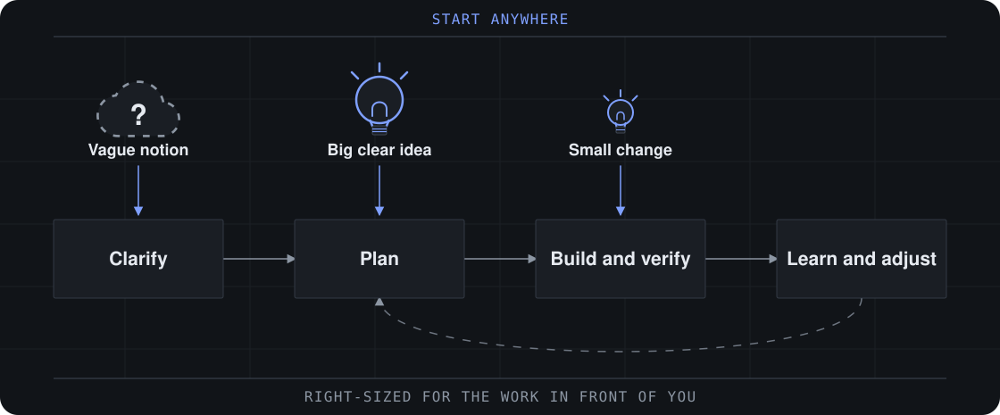

[](https://github.com/testemileum/funcionario-infinito/tags)
[](LICENSE)
[](https://discord.gg/SEU-CONVITE-AQUI)

**Agile Ai Driven Development — turn an idea or change request into working software without giving up the thinking.**

Ai Driven Development (AiDD) covers the whole effort, not only the code: what to build, how it holds together, and how it changes as you learn. Funcionário Infinito is the agile way to do it — decisions stay explicit, context carries forward, and the process sizes itself to the work. Small changes go straight to build. Complex work gets the depth it needs. The same method covers a weekend prototype and a system with years of history behind it.



_Start anywhere. Use Funcionário Infinito end to end, or carry its briefs, specifications, and architecture into your existing delivery workflow._

## Start Building

Choose one install route. You need an AI coding tool that supports skills and
[uv](https://docs.astral.sh/uv/) for Funcionário Infinito setup and Python scripts.

**Skills CLI** — with [Node.js and npm](https://nodejs.org) and Git, run in your project:

```bash
npx skills add testemileum/funcionario-infinito
```

Select the skills and coding tool you want; include `funcionario` for setup and help.

**Claude Code plugin** — add the marketplace inside Claude Code:

```text
/plugin marketplace add funcionario-infinito/funcionario-plugins
```

**Codex plugin** — add the marketplace from your terminal:

```bash
codex plugin marketplace add funcionario-infinito/funcionario-plugins
```

For either marketplace, install `funcionario-method` for the delivery workflows and
`funcionario-toolbox` for standalone skills, including the `funcionario` hub.

Open your coding tool in the project and ask the `funcionario` skill to run
`funcionario setup`. Then invoke `funcionario-build` with what you want to change. Ask
`funcionario` whenever you want guidance on what comes next or what is optional.

**[Build your first project with Funcionário Infinito →](https://docs.funcionario-infinito.com.br/start/build-your-first-change/)**

**[Add Funcionário Infinito to an existing codebase →](https://docs.funcionario-infinito.com.br/existing-codebases/start-in-an-existing-codebase/)**

Funcionário Infinito is free and open source, with no paywalled workflows or gated community.
Use `funcionario update` to check versions; install updates with `npx skills update`
or your plugin marketplace. After updating, ask for `funcionario doctor` to repair
the project's existing runtime.

## Why Funcionário Infinito?

Coding assistants are effective at implementation, but they often turn unstated assumptions into code. Funcionário Infinito keeps you in control while its agents and workflows make the important decisions explicit and preserve them as context for the work that follows.

- **Right-sized process** — Go directly to implementation for clear changes or add deeper planning for larger initiatives.
- **New or existing code** — Start from nothing, or establish verified context on a codebase you inherited and work from what is actually there.
- **Durable context** — Carry product and technical decisions forward instead of re-explaining them in every chat.
- **Specialized perspectives** — Bring in product, architecture, UX, development, and testing expertise when it helps.
- **Guided collaboration** — Use structured workflows and multiple-agent discussions without handing over judgment.
- **One delivery path** — Move from early thinking through reviewed implementation, correction, and learning.

[See how much planning a change needs →](https://docs.funcionario-infinito.com.br/plan/choose-a-planning-path/)

## Funcionário Infinito Ecosystem

Install the core method or add official modules for specialized work.

| Module | Purpose |
| --- | --- |
| **[Funcionário Infinito](https://github.com/testemileum/funcionario-infinito)** | Plan and deliver software, from new prototypes to established codebases |
| **[Funcionário Infinito Builder](https://github.com/funcionario-infinito/funcionario-builder)** | Skill, workflow, and agent builder |
| **[Funcionário Infinito Creative Intelligence Suite](https://github.com/funcionario-infinito/funcionario-module-creative-intelligence-suite)** | Creative thinking partners for innovation, design thinking, and storytelling |
| **[Funcionário Infinito Test Architect](https://github.com/funcionario-infinito/funcionario-method-test-architecture-enterprise)** | Enterprise testing add-on for Funcionário Infinito |
| **[Funcionário Infinito Loop](https://github.com/funcionario-infinito/funcionario-loop)** | Builds, verifies, and retros a whole epic unattended |
| **[Funcionário Infinito Game Dev Studio](https://github.com/funcionario-infinito/funcionario-module-game-dev-studio)** | Ideate, design, and build games in any framework, including Unity, Unreal, Godot, and Phaser |

## Plan on the Web

[Web bundles](https://funcionario-infinito.com.br/web-bundles/) package selected Funcionário Infinito workflows as Google Gemini Gems and ChatGPT Custom GPTs. Use them for planning in your existing web subscription, then bring the resulting artifacts into your AI coding tool for implementation.

## Documentation

- **[Build Your First Change](https://docs.funcionario-infinito.com.br/start/build-your-first-change/)** — Install Funcionário Infinito and build a small project.
- **[Choose a Planning Path](https://docs.funcionario-infinito.com.br/plan/choose-a-planning-path/)** — Pick how much planning a change needs and see what each planning skill produces.
- **[Start in an Existing Codebase](https://docs.funcionario-infinito.com.br/existing-codebases/start-in-an-existing-codebase/)** — Add Funcionário Infinito to an existing codebase.

## Community

- [Discord](https://discord.gg/SEU-CONVITE-AQUI) — Get help, share ideas, and collaborate.
- [YouTube](https://youtube.com/@funcionarioinfinito) — Watch tutorials and master classes.
- [GitHub Issues](https://github.com/testemileum/funcionario-infinito/issues) — Report bugs and request features.
- [GitHub Discussions](https://github.com/testemileum/funcionario-infinito/discussions) — Join longer community conversations.
- [Funcionario Infinito](https://funcionario-infinito.com.br) — Explore the wider ecosystem.

## Support and Contributing

Funcionário Infinito is free for everyone and always will be. Star the repository, [buy me a coffee](https://buymeacoffee.com/funcionario), or email <contact@funcionario-infinito.com.br> for corporate sponsorship.

Contributions are welcome. Read [CONTRIBUTING.md](CONTRIBUTING.md) before opening a pull request.

## License

MIT License — see [LICENSE](LICENSE) for details.

**Funcionário Infinito** and **funcionario-infinito** are trademarks of Funcionario Infinito. See [TRADEMARK.md](TRADEMARK.md) for details.

If you would like to contribute, join us in the discord and read [CONTRIBUTORS.md](CONTRIBUTORS.md) first.
